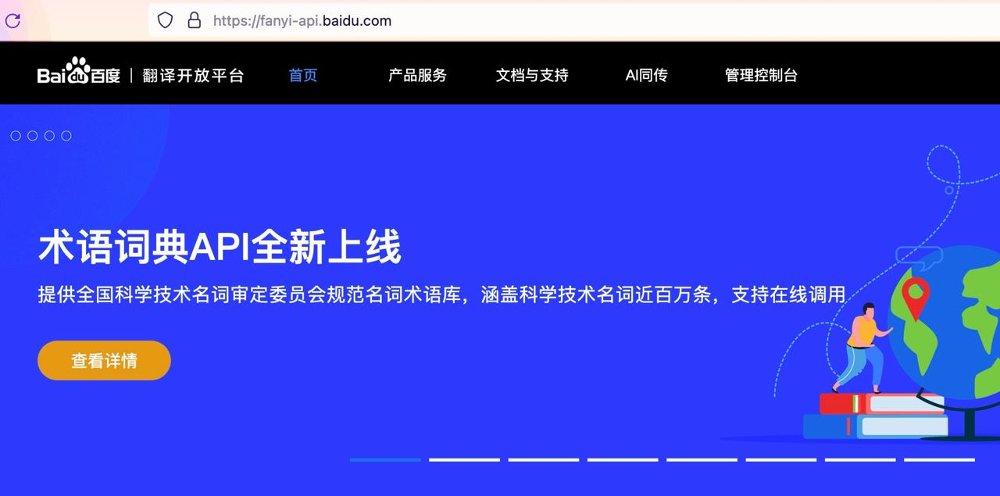
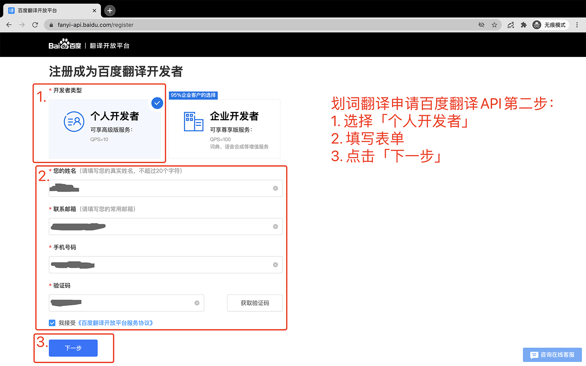

# 百度翻译

> 💡 提示
> 
>文档内容可能会过时，请以百度翻译官网说明为准。
>
>相关链接：[百度翻译开放平台](https://fanyi-api.baidu.com/) [百度翻译通用翻译API定价文档](https://fanyi-api.baidu.com/product/112)

## 价格

百度翻译官方接口有三个版本：标准版、高级版和尊享版。

标准版每月只有 5 万免费字符，当你完成个人认证后，你可以切换到高级版，高级版每月有 100 万字符免费。**用完免费额度后，超出的部分会按照 49 元 / 百万字符收取费用，费用由百度翻译在它自己的[百度翻译开放平台](https://fanyi-api.baidu.com/)收取**，与沉浸式翻译无关，但它每秒可以获取 10 次翻译结果，所以不会出现翻译较慢的情况。

百度翻译是按天计费的，目前还不确定超过免费额度后会不会给出提示，建议在百度翻译开放平台里充值 1 元，然后在[财务总览](https://fanyi-api.baidu.com/api/trans/product/desktop?req=account)页面设置余额低于 1 元就短信提醒。但是请注意，按天计费意味着在一天之内无论产生了多少使用量都不会有实时提醒，只会在每天结算的时候（一般是凌晨一点）才会有提醒。

尊享版需要企业认证，不适用于个人用户，所以这个文档里没有介绍尊享版。

## 申请步骤

### 第一步：登录百度翻译开放平台

打开[百度翻译开放平台](https://fanyi-api.baidu.com/) 并登录你的百度账号，登录成功后点击「管理控制台」。

### 第二步：注册成为百度翻译开发者

第一次进入管理控制台会让你注册成为百度翻译开发者，如下图。选择「个人开发者」并填写表单后点击「下一步」。注册成功后会让你进行身份认证，如果你不想用高级版可以点「取消」，否则就需要认证。

第三步：开通「通用翻译服务」

注册成功后，打开[控制台](https://fanyi-api.baidu.com/api/trans/product/desktop)，点击「立即开通」按钮，然后：

- 选择「通用翻译（适用于文本翻译）」并点击「下一步」
- 选择「开通标准版」
- 填写应用名称"沉浸式翻译"然后点击「提交申请」，会提示「开通成功」

### 第四步：在沉浸式翻译中填写百度翻译 APP ID 和密钥

打开百度翻译开放平台[控制台](https://fanyi-api.baidu.com/api/trans/product/desktop)，将页面最底部的「APP ID」和「密钥」填写进沉浸式翻译的【基本设置】-【翻译服务】-【百度翻译】中。

