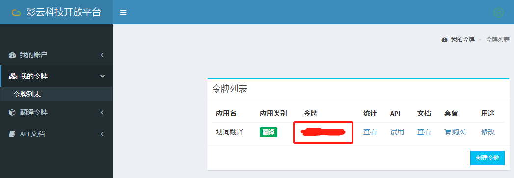
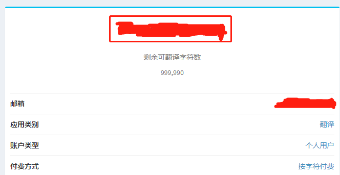

# 彩云小译

> 💡 提示 
> 
> 文档内容可能会过时，请以彩云小译官网说明为准。
> 
> 相关链接：[彩云小译 API 文档](https://docs.caiyunapp.com/blog/2018/09/03/lingocloud-api/) [彩云科技开放平台](https://dashboard.caiyunapp.com/)

## 价格

彩云小译**每月的前 100 万字符免费，超出后会按照 20 元 / 百万字符收取费用，费用由彩云小译在它自己的[彩云科技开放平台](https://dashboard.caiyunapp.com/)收取，与沉浸式翻译无关**。

虽然官方文档上没有写，但彩云小译似乎是按天计费的，如果免费额度用完了，彩云小译会停用并报一个错误“服务器返回了错误的响应码 402”。但是请注意，按天计费意味着在一天之内无论产生了多少使用量都不会有实时提醒，只会在每天结算的时候（一般是凌晨一点）才会有提醒。

## 申请步骤

### 第一步：完成开发者认证

登录[彩云科技开放平台](https://dashboard.caiyunapp.com/)，进入[我的账户 - 开发者信息](https://dashboard.caiyunapp.com/user/user/info/)填写开发者信息：

- 【账户类型】选择【个人姓名/非盈利组织名】
- 【个人姓名/组织名】和【联系名】都填写你的名字
- 【联系电话】填写你的真实手机号

进入下一步之后：

- 【应用类别】选择【彩云小译 API】
- 【应用名】填写【沉浸式翻译】
- 【应用链接】填写【immersive-translate】
- 【应用开发情况】填写【浏览器扩展程序，已开发完成】

填写完成之后点击【提交】按钮，彩云小译会审核你提交的信息，一般两个工作日内就会审核通过。

### 第二步：获取彩云小译 API Token

审核通过后，进入[我的令牌 - 令牌](https://dashboard.caiyunapp.com/v1/token/)列表，会看到下图所示的界面：

点击表格里【令牌】这一列的链接，会进入如下页面，红框标注的地方就是彩云小译的 API Token：

### 第三步：将彩云小译 API Token 填进沉浸式翻译

将上一步获取的彩云小译 API Token 填写进沉浸式翻译的【基本设置】-【翻译服务】-【彩云小译】即可。

