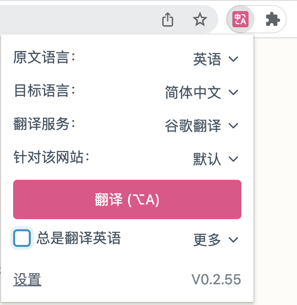
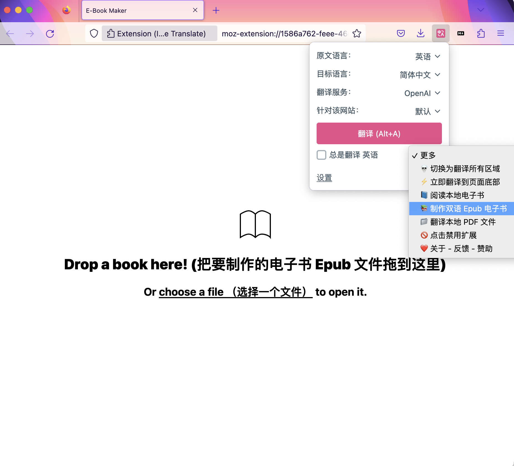
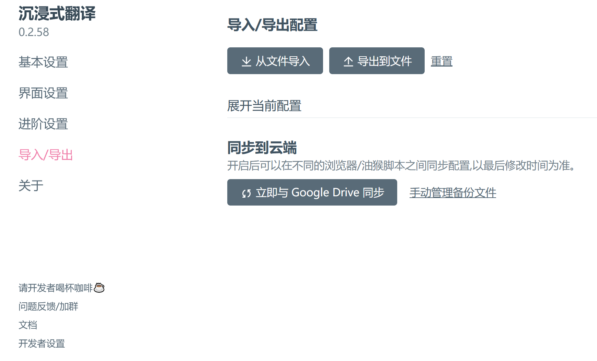

# 如何使用？

安装插件后，右上角点击【沉浸式翻译扩展图标】，点击翻译即可进行翻译：

或者，也可以在网页里右键，选择【翻译网页/显示原文】进行翻译。

如果你喜欢快捷键，还可以使用快捷键进行翻译，以下是默认快捷键：

    Alt+A: 翻译/切换原文，按一下翻译，再按一下显示原文。

    Alt+W: 翻译整个页面，而不是默认的智能翻译内容区域。

如果默认快捷键与别的软件快捷键冲突，可以在扩展的【设置页面 - 界面设置 - 快捷键管理】中修改，可以设置为 `Alt+Q`，`Alt+E` 等。

你可以在[Buzzing](https://www.buzzing.cc/)里随便点击一篇英文报道试试效果～

## 设置页面

点击浏览器右上角的扩展图标，点击【设置】，即可进入扩展的设置页面。

在设置页面里我们可以进行一系列的个性化设置。

比如在【界面设置】里，我们可以修改 **译文样式**：

## 油猴脚本设置页面

如果你使用的是油猴脚本，那么你需要进入 [在线网页版设置页面](https://immersive-translate.owenyoung.com/options/) 才能设置一些高级选项，点击浮窗里的【设置】链接进入该页面，或者直接 [点此](https://immersive-translate.owenyoung.com/options/) 进入。

> Tips: 油猴脚本的浮窗可以任意拖动位置～

## Epub 文件翻译

点击插件图标，【更多】，阅读电子书（支持 Epub，Mobi 等常见格式）或者制作双语电子书。

## PDF 文件翻译

> 目前只支持简单的单列 PDF 翻译，复杂的 PDF 建议使用相关工具转为 HTML 后，再由插件翻译。
>
> 推荐一个超级好用且免费的开源软件 [calibre](https://calibre-ebook.com/)，可以把 pdf 转为 epub 或 html，效果非常赞。

> 目前油猴脚本不支持 PDF 文件翻译，请下载扩展使用～

1. 如果是在线的 PDF 文件，在浏览器打开后，点击扩展的图标，然后点击翻译该文件即可，如下图所示。

2. 如果是本地的 PDF 文件，直接右键扩展的图标（或者左键点击扩展图标，然后点击「更多」，点击「翻译本地 PDF 文件」），进入页面后，点击页面右上角上传你的 PDF 文件即可。

## 配置同步功能

你可以将配置信息在本地导出进行同步，也可以使用 Google Drive 进行同步。

> 该扩展免费使用，希望大家都能轻松、愉悦、优雅地获取互联网上海量的外文信息，不要让语言成为障碍 ❤️
>
> 感谢这些 [赞助者](https://immersive-translate.owenyoung.com/thanks)，由于他/她们的支持，更多的人可以免费地使用这个工具。如果有余力，请 [点击这里](https://immersive-translate.owenyoung.com/donate) 赞助我的工作。你可以通过 [推特](https://twitter.com/OwenYoungZh)， [Telegram 频道](https://t.me/owenyoungzh) 或 [其他方式](https://www.owenyoung.com/contact/) 和我保持联系。

## 赞助

**所有用户都可以完全免费地，不受任何限制地使用沉浸式翻译扩展！**

**这完全得益于[这些赞助者](https://immersive-translate.owenyoung.com/thanks)的慷慨支持。**

我在开发和维护这个扩展上花费了巨大的精力，所以如果有余力，请考虑成为一名赞助者（金额随意）：

你也可以通过我的 [Github Sponsor 主页](https://github.com/sponsors/theowenyoung?frequency=recurring)、[爱发电主页（微信/支付宝）](https://afdian.net/a/translate)、[Patreon 主页](https://www.patreon.com/theowenyoung)、[加密货币](https://www.owenyoung.com/contact/) 进行赞助。

### 赞助方案

免费工具作者似乎可以和赞助者之间建立一种双赢的关系！所以我想出了以下的赞助方案，这能让我为赞助者做点什么（Ps. 如果你对以下的方案不感兴趣，完全没关系，你还是可以按照你的意愿随意赞助）

 

| $5                                                                                                                                          | $10/月(限时)                                                                                                                                                                                                                 |
| ------------------------------------------------------------------------------------------------------------------------------------------- | ---------------------------------------------------------------------------------------------------------------------------------------------------------------------------------------------------------------------------- |
| ✅ 加入 Pro 群组 ✅ 问题优先解决 ✅ 在[首页](https://immersive-translate.owenyoung.com/#%E8%B5%9E%E5%8A%A9%E8%80%85%E4%BB%AC)展示头像 | ✅ 包含以上所有 ✅ 每月 2000 万字符的 [DeepL](https://immersive-translate.owenyoung.com/services/deepL)翻译 ✅ 在[首页](https://immersive-translate.owenyoung.com/#%E8%B5%9E%E5%8A%A9%E8%80%85%E4%BB%AC)展示头像和昵称 |

**现在就 [进入我的 Github Sponsor 主页](https://github.com/sponsors/theowenyoung?frequency=recurring)或者[爱发电主页(支持微信/支付宝) ](https://afdian.net/a/translate) 成为赞助者 ！**

## 了解更多

- [翻译服务申请](https://immersive-translate.owenyoung.com/services.html)
- [高级自定义配置](https://immersive-translate.owenyoung.com/advanced.html)
- [常见问题](https://immersive-translate.owenyoung.com/faq.html)
- [更新日志](https://immersive-translate.owenyoung.com/CHANGELOG.html)
- [Github](https://github.com/immersive-translate/immersive-translate/)

## 与沉浸式翻译扩展保持联系

- [通过邮件订阅沉浸式翻译](https://immersivetranslate.substack.com/) 及时获得最新更新。
- [加入沉浸式扩展 Telegram 群组](https://t.me/+rq848Z09nehlOTgx) 参与功能讨论。
- [加入沉浸式扩展 Telegram 频道](https://t.me/immersivetranslate) 接收最新消息。
- [问题反馈](https://github.com/immersive-translate/immersive-translate/issues/)
- [请开发者喝杯咖啡 ☕️](https://immersive-translate.owenyoung.com/donate.html)
