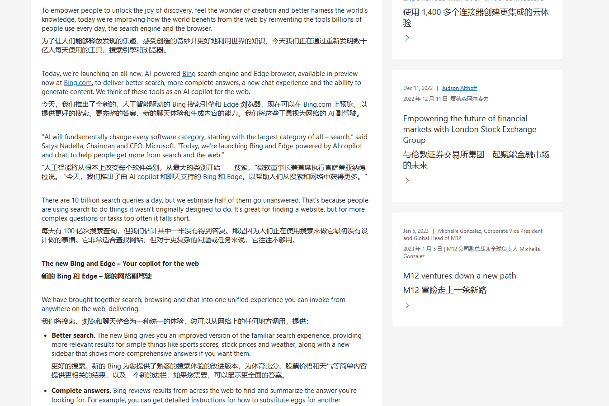
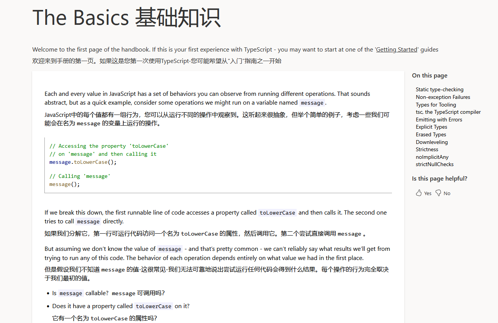
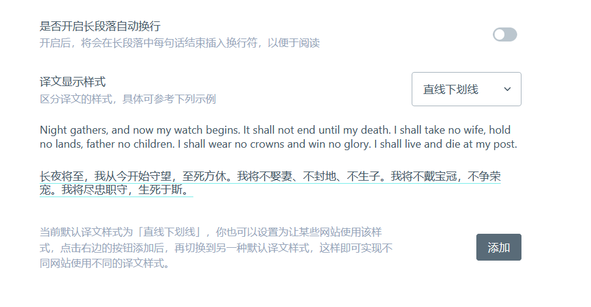
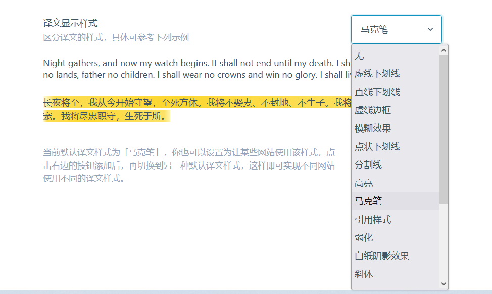

# 使用案例

## 视频介绍

<iframe width="560" height="315" src="https://www.youtube.com/embed/0nIzWCseLVo" title="YouTube video player" frameborder="0" allow="accelerometer; autoplay; clipboard-write; encrypted-media; gyroscope; picture-in-picture; web-share" allowfullscreen></iframe>

- [Youtube](https://youtu.be/0nIzWCseLVo)

## 双语电子书制作

<iframe width="560" height="315" src="https://www.youtube.com/embed/V3Q9t9GCOm4" title="YouTube video player" frameborder="0" allow="accelerometer; autoplay; clipboard-write; encrypted-media; gyroscope; picture-in-picture; web-share" allowfullscreen></iframe>

## 苹果 iOS 安装沉浸式翻译视频教程

<iframe width="560" height="315" src="https://www.youtube.com/embed/IWOFFWDfZGY" title="YouTube video player" frameborder="0" allow="accelerometer; autoplay; clipboard-write; encrypted-media; gyroscope; picture-in-picture; web-share" allowfullscreen></iframe>

## 普通文章，译文无样式：

## 技术文档，译文无样式

## 推特，译文弱化样式

## PDF 文件翻译

## 更多样式请查看设置界面

